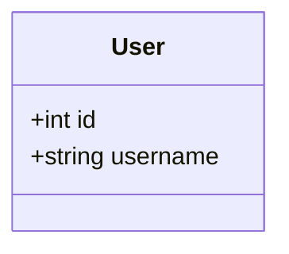
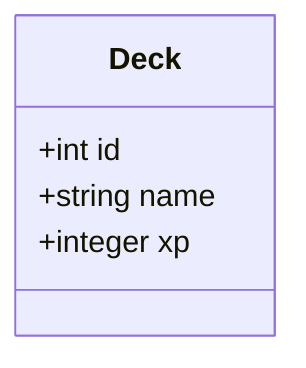
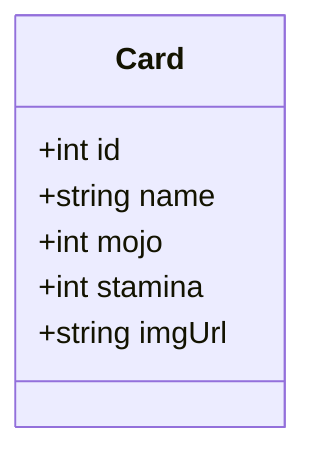
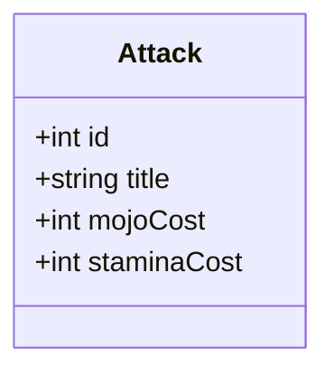
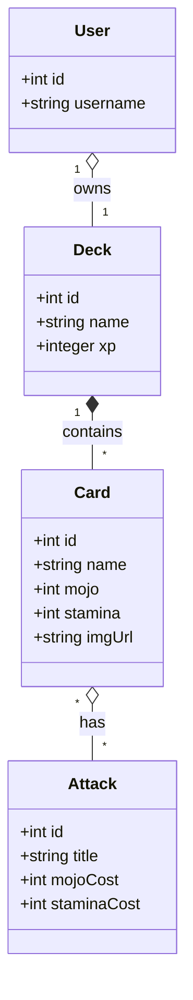

# Mojo: The Summoning

_Mojo: The Summoning_ is a card-collecting game where players battle 1 on 1 using their decks of Cards.

**GOAL**: Construct the backend database for Mojo: The Summoning by configuring Sequelize, defining models (`User`, `Deck`, `Card`, and `Attack`), defining associations, and test the models and associations in corresponding test file.

## Starting Point

This is an ***existing*** codebase that your team have already been working on. You will be working in the `server` folder to set up the database layer. The front end is contained in the `client` folder and you do not need to modify anything contained within this folder.

To preview the database output, read the section [Trying Out the App](./README.md#try-out-the-app)

## Part 1: Connect to Sequelize

Once you have the project locally on your machine, you're ready to start your work!

### Install Dependencies

1.  `cd` into the `server` directory
2. Then, use `npm` to install the `sqlite3`, `sequelize` and `jest` packages.

⚠️ **Warning:** Make sure you `cd` into `server` first! This project has multiple folders and you do not want to install dependencies into the wrong one.

### Configure Your Connection

1. In `server/src/db/config.js` connect to your database using Sequelize.

## Part 2: Define Models

1. Work in the `server/src/models` directory to create the following models according to the corresponding class diagrams:
  - `User`
  - `Deck`
  - `Card`
  - `Attack`
2. When defining your models, make sure to do the following so that the front end will work:
  - The model name should be the same name as your model
  - Use titlecase (i.e. uppercase) for the model name:
    ```javascript
    let Example = db.define("Example", {
      // properties
    })
    ```
    If using this style
    ```js
    class Example extends Model {}
    
    Example.init({
      // properties
    }, { sequelize: db })
    ```
    you don't need to do anything as the titlecase model name is provided for you by default.

### User



(This file has been created but is empty.)

### Decks



(This file does not exist. You need to create it in the `models` directory.)

### Cards



### Attacks



### Part 3: Create Unit Tests

1. One test file has been started for you in `models/User.test.js`.
2. Continue to write unit tests which check that each of your models functions correctly with each model getting its own testing file (e.g. `Card.test.js`).
3. It is recommended to import into your test files from `models/index.js`. 
4. Run the tests with `npm run test`.

## Part 4: Define Associations
1. In `models/index.js`, create associations according to the specifications outlined below.



You should set up the associations in `models/index.js`.

### User/Deck

Each User may create exactly one Deck. For example, a User `gandalf` might create a Deck called `The Fellowship`.

1. Associate Users and Decks with a one-to-one relationship.
2.  Add tests to check the association.

### Deck/Card

Each Deck may contain many Cards. A Card may only belong to one Deck. For example,  `The Fellowship` might contain Cards called `Lizard Wizard` and `Bulk Brogan`. Two Decks might contain Cards with the same name, but these are considered different Cards, and would have different IDs.

1. Associate Decks and Cards with a one-to-many association
2. Add tests to check the association

### Card/Attack

Each Card may have many Attacks. Each Attack may belong to many Cards. For example, `Lizard Wizard` and `Bulk Brogan` might both have a `Charge` attack. Lizard Wizard might have a `Thunderbolt` and `Bulk Brogan` a `Piledriver`.

1. Associate Cards and Attacks with a many-to-many association
2. Add tests to check the association
 
## Try Out the App!
 
If you're models are successfully defined, you should be able to run the app and view the results in the browser.

**In the `server` folder:**

1. In a terminal, `cd` into `server` and run
  ```bash
  npm install
  npm run seed
  npm run dev
  ```
 This will start the development server (the back-end).

**In the `client` folder:**

1. In a separate terminal, `cd` into `client` and run
  ```bash
  npm install
  npm run dev
  ```
This will start the client (the front-end). You should see a url (usually localhost:5173). Visit this url in your browser to see the client displaying data requested from the database.

**Tip**: to stop the servers running, click in the terminal and press `ctrl + c`
